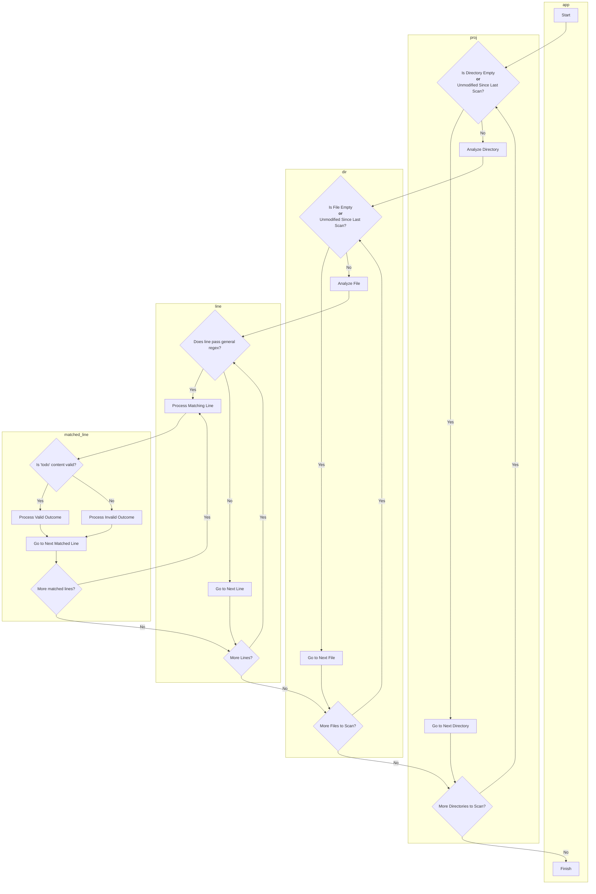

# todolint

todolint is a lightweight tool designed to collect and process `todo` marked comments across project files. It adheres to a defined [specification](#comment-specification) for comment structure, where comment tagging is a key feature.

## Existing Features
(todo)

## Future Features
Features to be added, with high priority:
- Fixing line analyzer logic (i.e. all tests pass)
- Add additional unit tests and functional tests

Features to be added, in no particular order:
- Support for multi-line comments (e.g. `/* ... */`)
- Basic performance metrics: speed, memory usage, size of output
- Parallelization for improved processing speed
- Using I/O buffers for file reads
- Improved logging (generals logs + errors)
- Support for a user-provided config file
- Support for "flags":
  - Output to terminal or a BSON file or both
  - "Audit" feature for correcting invalid entries
  - Specify location of config file
- For existing scanned files, use of file modification time and last scan time to determine rescanning necessity

## Potential Future Features
Features that have potential but require additional thought:

(todo)

## Output Options
(todo)

## Comment Specification
(todo)

## Dev Details

### Diagrams

High-level diagram of the app's logic.

