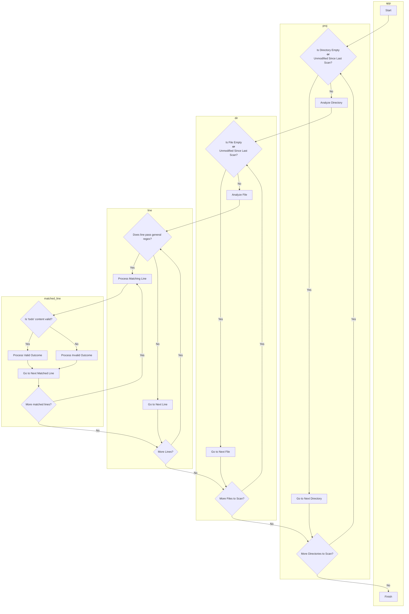

# Dev Details

High-level diagram of the app's logic.

```mermaid
flowchart TD

subgraph app
    Start[Start]
    Finish[Finish]
end

subgraph proj
    CheckDir{"`Is Directory Empty
    **or**
    Unmodified Since Last Scan?`"}
    NextDir[Go to Next Directory]
    AnalyzeDir[Analyze Directory]
    MoreDirs{More Directories to Scan?}

    Start --> CheckDir
    CheckDir -->|Yes| NextDir
    CheckDir -->|No| AnalyzeDir
    MoreDirs -->|Yes| CheckDir
    NextDir --> MoreDirs
    MoreDirs -->|No| Finish
end

subgraph dir
    CheckFile{"`Is File Empty
    **or**
    Unmodified Since Last Scan?`"}
    NextFile[Go to Next File]
    AnalyzeFile[Analyze File]
    MoreFiles{More Files to Scan?}

    AnalyzeDir --> CheckFile
    CheckFile -->|Yes| NextFile
    CheckFile -->|No| AnalyzeFile
    MoreFiles -->|Yes| CheckFile
    NextFile --> MoreFiles
    MoreFiles -->|No| MoreDirs
end

subgraph line
    CheckLine{Does line pass general regex?}
    ProcessLine[Process Matching Line]
    NextLine[Go to Next Line]
    MoreLines{More Lines?}

    AnalyzeFile --> CheckLine
    CheckLine -->|Yes| ProcessLine
    CheckLine -->|No| NextLine
    NextLine --> MoreLines
    MoreLines -->|Yes| CheckLine
    MoreLines -->|No| MoreFiles
end

subgraph matched_line
    ValidTodo{Is 'todo' content valid?}
    MoreMatchedLines{More matched lines?}
    NextMatchedLine[Go to Next Matched Line]
    ValidOutcome[Process Valid Outcome]
    InvalidOutcome[Process Invalid Outcome]

    ProcessLine --> ValidTodo
    ValidTodo -->|Yes| ValidOutcome
    ValidTodo -->|No| InvalidOutcome
    MoreMatchedLines --> |Yes| ProcessLine
    MoreMatchedLines -->|No| MoreLines
    ValidOutcome --> NextMatchedLine
    InvalidOutcome --> NextMatchedLine
    NextMatchedLine --> MoreMatchedLines
end
```

